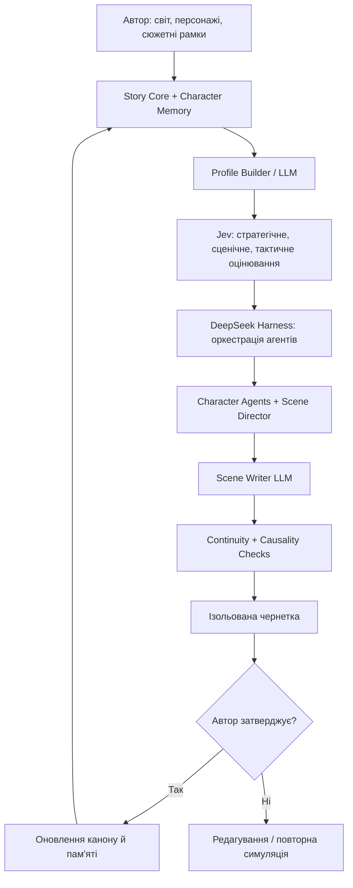
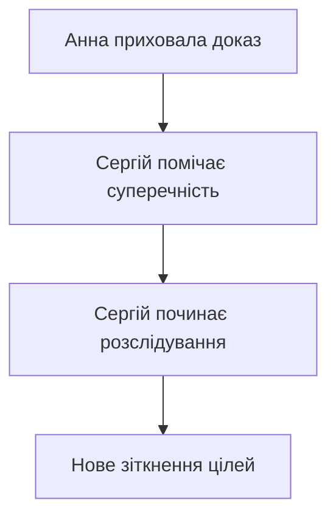

# Fusion Living Characters 2.0 — доповнення до ТЗ Harness + Jev

> Першоджерело: доповнення власника, передане в розмові 24.09.2026 (сесія
> Claude #01, журнал #240). Текст збережено дослівно, лише з розміткою
> Markdown. Базове ТЗ — `TZ_Harness_Jev_v1.0.pdf`; план — `PLAN_ROADMAP.md`.

Тип документа: окремий блок доповнень до Fusion_Lab_Studio_Harness_Jev_Integration_TZ v1.0
Призначення: додати довготривале життя персонажів, багаторівневе оцінювання Jev, типологію секретів, причинно-наслідковий контроль і оновлений план реалізації.
Статус: пропозиція для наступної coding-сесії; не замінює базове ТЗ.

## 1. Головна зміна концепції

Перейти від генератора окремих сцен до системи безперервного життя AI-персонажів. Письменник створює світ, характери та сюжетні рамки; персонажі зберігають пам’ять про пережиті події, змінюють переконання й наміри, взаємодіють між собою та впливають на розвиток сюжету. Канон книги змінюється лише після затвердження автором.

Межі відповідальності: Story Core відповідає за підтверджені факти, версії й права доступу; LLM збирає доказовий профіль і пише прозу; Jev оцінює короткі структуровані запитання та альтернативи; Harness керує виконанням агентів і tools. Jev не слід використовувати як єдине джерело психологічної істини або як засіб безпосереднього читання всього рукопису.

## 2. Довготривала суб’єктивна пам’ять

Доповнити наявні character_memories і character_states механізмом, що розрізняє:

- Світовий факт: що підтверджено сталося в книзі.
- Знання персонажа: що герой міг дізнатися на момент конкретної сцени.
- Переконання персонажа: у що герой вірить, зокрема помилково.
- Суб’єктивний спогад: як герой інтерпретує пережиту подію.
- Наслідок: як подія змінила довіру, страх, цілі чи стосунки.

Приклад: після сварки Сергій вважає, що Анна збрехала, і вирішує перевірити її слова; Анна вважає, що Сергій більше їй не довіряє, і приховує ще одну обставину. Один підтверджений факт створює дві різні персональні інтерпретації.

Вимоги: кожен спогад має source_event_id, story_time, character_id, belief_status, visibility, simulation_id або canon_revision; нова симуляція не повинна використовувати незатверджені спогади іншого прогону. Після редагування вихідної сцени залежні спогади перевіряються повторно.

## 3. Три рівні Jev Character Decision Engine

| Рівень | Що оцінюється | Коли запускати |
|---|---|---|
| Стратегічний | Довгострокові цілі, конфлікт мотивів, допустимі траєкторії розвитку | Після значущих сюжетних подій або зміни канону |
| Сценічний | Поточні мотиви, емоції, ризики й доступні дії в конкретній сцені | Перед сценою або після суттєвого повороту |
| Тактичний | Наступна дія чи реакція з дозволеного списку | Перед відповідним ходом персонажа |

Profile Builder формує короткий доказовий snapshot; Scene Director або окремий генератор альтернатив створює допустимі варіанти; Jev оцінює їх атомарними Choice/Score-запитаннями; серверний валідатор відхиляє порушення жорстких сюжетних і безпекових обмежень. Відповіді Jev — модельні евристики, а не об’єктивні психологічні вимірювання. Порівнювати результати з підтвердженими фактами та перевірками LLM.

Оптимізація: стратегічний стан кешувати до наступної значущої події; сценічний — до зміни умов сцени; тактичний — оновлювати за потреби. Усі рішення зберігати з snapshot_hash, версією моделі й підставами.

## 4. Три типи секретів

1. Особистий секрет: персонаж знає, автор за вибором може не знати; впливає на його поведінку й діалоги.
2. Помилкове переконання: персонаж щиро вважає щось правдою, хоча підтверджений світовий факт або сюжетна істина інші. Не записувати переконання як world_truth.
3. Світова таємниця: факт, невідомий жодному з персонажів; ним керує окремий Mystery Director, який визначає докази, натяки та умови розкриття.

Для прихованих секретів використовувати наявний Secret Vault: серверна ізоляція, фіксація до першого використання, незмінний журнал і commitment_hash. Передбачити Emergency Reveal, Freeze Secret і заборону ретроспективної зміни вже використаної таємниці. Mystery Director отримує доступ лише до потрібних світових таємниць; Character Agent — лише до знань свого героя.

## 5. Causality Engine — контроль наслідків

Доповнити Continuity Checker механізмом причинно-наслідкових зв’язків:

Кожне важливе рішення може породжувати consequence та залежності caused_by, triggers, prevents, leads_to. Система повинна перевіряти, чи мав персонаж достатні знання для дії, чи існує зрозумілий причинний перехід і чи не суперечить нова подія затвердженому канону. Не вимагати, щоб усі художні події були повністю передбачуваними: допустимі випадковість, хибні припущення та навмисна загадка.

## 6. Оновлена дорожня карта

**Етап 0 — Технічний прототип**

- Перевірити актуальні контракти Harness і Jev, закріпити версії.
- Через адаптери виконати один цикл: retrieval → профіль → Jev Choice → Harness/LLM → чернетка.
- Передбачити mock Jev та fallback на структуровану відповідь LLM.

**Етап 1 — Один живий персонаж**

- Побудувати доказовий профіль і довготривалу суб’єктивну пам’ять.
- Додати перемикач «AI-персонаж» і режим «Допитати персонажа».
- Після авторського затвердження оновлювати канон і пам’ять.

**Етап 2 — Перевірка якості персонажа**

- Створити контрольний набір сцен і запитань.
- Перевіряти сталість характеру, точність пам’яті, ізоляцію знань, відсутність спойлерів, різноманітність реакцій і відповідність авторському стилю.
- Порівняти результати з Jev і без Jev, а також час і вартість виконання.

**Етап 3 — Два-три автономні персонажі**

- Додати Scene Director, окремі контексти й послідовні ходи.
- Реалізувати спільну сцену, протокол подій, Scene Writer, continuity та diff.

**Етап 4 — Секрети та розвиток сюжету**

- Реалізувати три типи секретів, Secret Vault і Mystery Director.
- Додати Causality Engine, правила розкриття, контроль незмінності секретів і тести витоків.

**Етап 5 — Прискорення й масштабування**

- Інкрементальний аналіз, кеші станів, паралельна підготовка профілів, streaming, бюджети токенів, черга задач і спостережуваність без витоку приватних даних.

## 7. Рекомендований перший продукт — «Допит живого персонажа»

Почати з одного AI-персонажа, а не з повністю автономної сцени. Автор позначає героя, відкриває режим допиту й ставить запитання. Story Core знаходить підтверджені згадки; Profile Builder формує персональний snapshot; Jev оцінює допустимі реакції; агент Harness через LLM формує відповідь від імені героя. Допит зберігається як дослідницька симуляція, не як канон.

Мінімальні критерії приймання:

- Кожен факт профілю має джерело або позначку гіпотези.
- Герой не використовує майбутні відомості та чужі приватні секрети.
- Десять послідовних відповідей не втрачають контекст і не змінюють підтверджений канон.
- Автор може прийняти окремі результати до канону або відхилити їх.
- Після зміни затвердженої сцени залежна пам’ять інвалідовується та перевіряється.
- За недоступності Jev використовується задекларований fallback без втрати стану й розкриття секретів.

## 8. Нові задачі для coding-сесії

1. Розширити character_memories полями суб’єктивної інтерпретації, джерел, часової дії та статусу канону.
2. Реалізувати CharacterMemoryService і revision-aware invalidation.
3. Додати три рівні оцінювання до JevDecisionAdapter із кешуванням і серверною валідацією.
4. Додати тип world_secret і MysteryDirector до секретного контуру.
5. Реалізувати CausalityService поверх зв’язків Story Core.
6. Створити тестовий сценарій «Допит живого персонажа» та набір регресійних перевірок.

> **Архітектурний принцип:** AI-персонаж — не просто генератор реплік. Це агент із власною історією, обмеженими знаннями, суб’єктивною пам’яттю, переконаннями й послідовністю рішень. Його дії можуть бути несподіваними для автора, але не повинні довільно переписувати затверджені факти книги.
